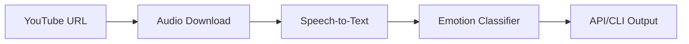
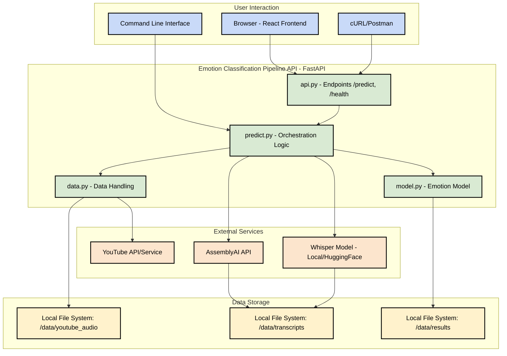
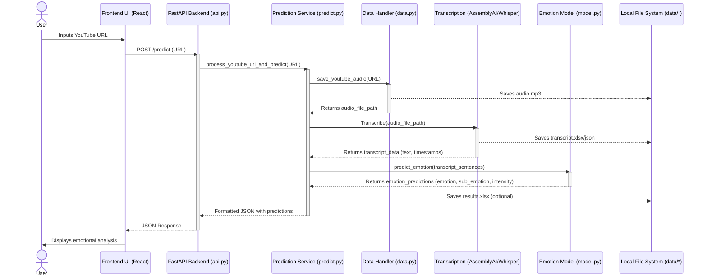
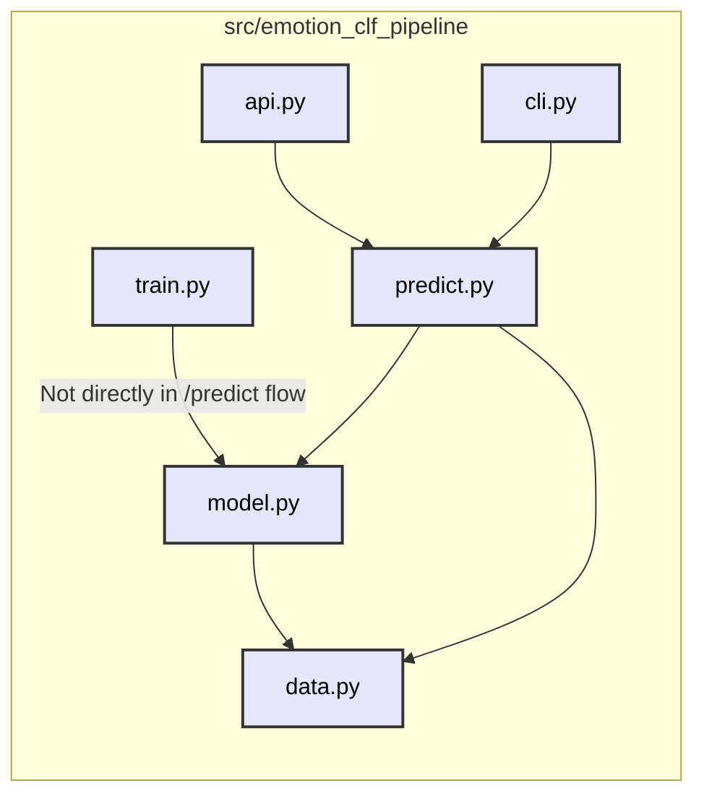

<div align="center">

<!-- PROJECT LOGO -->
<!-- <br /> -->
<!--  -->
<h1>Emotion Classification Pipeline</h1>

<!-- BADGES -->
[](https://www.python.org/downloads/release/python-3110/)
[](https://opensource.org/licenses/MIT)
[](https://python-poetry.org/)
[](https://github.com/BredaUniversityADSAI/2024-25d-fai2-adsai-group-nlp6/actions/workflows/lint.yaml)
[](https://github.com/BredaUniversityADSAI/2024-25d-fai2-adsai-group-nlp6/actions/workflows/test.yaml)

<p align="center">
  <b>An advanced NLP tool for delivering actionable emotional insights from video and audio content.</b>
  <br />
  <i>Transforming unstructured media into meaningful emotional analytics</i>
</p>


<!-- PROJECT DEMO -->
<p align="center">
  <a href="#overview">
    
  </a>
</p>

<p align="center">
  <a href="#installation"><strong>Installation & Usage</strong></a> •
  <a href="#contributing"><strong>Contributing</strong></a> •
  <a href="#license"><strong>License</strong></a>
</p>

</div>

<br>

## 📋 Table of Contents

<ol>
  <li><a href="#overview">🌟 Overview</a></li>
  <li><a href="#project-structure">📁 Project Structure</a></li>
  <li><a href="#installation">🚀 Installation and Usage</a>
    <ul>
      <li><a href="#step-1---prerequisites">Step 1 - Prerequisites</a></li>
      <li><a href="#step-2---cloning-the-repository">Step 2 - Cloning the Repository</a></li>
      <li><a href="#step-3---creating-the-env-file">Step 3 - Creating the .env File</a></li>
      <li><a href="#step-4---setup--run">Step 4 - Setup & Run Options</a></li>
      <li><a href="#step-5---usage">Step 5 - Usage</a></li>
    </ul>
  </li>
  <li><a href="#contributing">👥 Contributing</a>
    <ul>
      <li><a href="#branch-naming-convention">Branch Naming Convention</a></li>
      <li><a href="#pull-request-process">Pull Request Process</a></li>
    </ul>
  </li>
  <li><a href="#architecture-diagrams">🗺️ Architecture Diagrams</a>
    <ul>
      <li><a href="#system-architecture-high-level">System Architecture (High-Level)</a></li>
      <li><a href="#data-flow-for-predict-endpoint">Data Flow for <code>/predict</code> Endpoint</a></li>
      <li><a href="#internal-component-diagram-srcemotion_clf_pipeline">Internal Component Diagram (<code>src/emotion_clf_pipeline</code>)</a></li>
    </ul>
  </li>
  <li><a href="#testing-procedures">🧪 Testing Procedures</a>
    <ul>
      <li><a href="#running-pytest">Running <code>pytest</code></a></li>
      <li><a href="#running-unittest">Running <code>unittest</code></a></li>
      <li><a href="#test-coverage">Test Coverage</a></li>
    </ul>
  </li>
  <li><a href="#license">📄 License</a></li>
</ol>

<br>

<a id="overview"></a>
## 🌟 Overview

Emotion Classification Pipeline is a sophisticated natural language processing tool designed to extract and analyze emotional content from video and audio data. Built with modern ML/AI techniques, our system delivers actionable emotional insights that can be used for content analysis, customer sentiment tracking, and more.

<br>

<a id="project-structure"></a>
## 📁 Project Structure

```
./
├── .github/                  # GitHub Actions workflows
├── assets/                   # Static assets (images, logos)
├── data/                     # Datasets (raw, processed)
├── dist/                     # Distribution files (build artifacts)
├── docs/                     # Project documentation
├── frontend/                 # React frontend application
├── logs/                     # Log files
├── models/                   # Trained machine learning models
├── notebooks/                # Jupyter notebooks for exploration
├── src/                      # Source code
│   └── emotion_clf_pipeline/ # Main Python package
│       ├── __init__.py
│       ├── api.py            # FastAPI application
│       ├── cli.py            # Command-line interface
│       ├── data.py           # Data loading and preprocessing
│       ├── model.py          # Model architecture
│       ├── predict.py        # Prediction logic
│       └── train.py          # Training scripts
├── tests/                    # Unit and integration tests
├── .flake8                   # Flake8 configuration
├── .gitignore                # Git ignore rules
├── .pre-commit-config.yaml   # Pre-commit hook configurations
├── Dockerfile                # Backend Docker configuration
├── docker-compose.yml        # Docker Compose for full-stack
├── LICENSE                   # Project license
├── poetry.lock               # Poetry lock file
├── pyproject.toml            # Python project configuration (Poetry)
└── README.md                 # This file
```

<br>

<a id="installation"></a>
## 🚀 Installation and Usage

This project offers several ways to get started, depending on your needs. Choose the method that best suits your workflow.

<br>

### Step 1 - Prerequisites

Before you begin, ensure you have the following installed:

- **Python**: Version 3.11 or higher.
- **Poetry**: For managing Python dependencies. ([Installation Guide](https://python-poetry.org/docs/#installation))
- **Docker**: For containerized deployment (optional but recommended for full-stack). ([Installation Guide](https://docs.docker.com/get-docker/))
- **Git**: For cloning the repository. ([Installation Guide](https://git-scm.com/book/en/v2/Getting-Started-Installing-Git))

<br>

### Step 2 - Cloning the Repository

First, clone the project to your local machine:

```bash
git clone https://github.com/BredaUniversityADSAI/2024-25d-fai2-adsai-group-nlp6.git
cd 2024-25d-fai2-adsai-group-nlp6
```

<br>

### Step 3 - Creating the .env File

Create a file named `.env` in the project root directory.
```bash
# From the project root directory
touch .env
```

Include all the required API keys inside the `.env`.
```
ASSEMBLYAI_API_KEY="your_actual_assemblyai_api_key"
```

This file is used by `docker-compose.yml` and the `Dockerfile` to provide secrets to the application.

<br>

### Step 4 - Setup & Run

#### Option 1. Docker Compose (Run Frontend and Backend Containers) <mark> Recommented </mark>

This is the recommended method for running the complete application, including the React frontend and the Python backend.

```bash
# Ensure you are in the project root directory
docker-compose up --build
```

This will start both the frontend (accessible at `http://localhost:3000`) and the backend API (accessible at `http://localhost:8000`).


#### Option 2. Run Docker Container (Backend API only)

This method containerizes the backend API, making it easy to deploy and run in isolation.

```bash
# Build image from Dockerfile
docker build -t emotion-clf-api .

# Run a container for "emotion-clf-api" image
docker run -p 8000:80 emotion-clf-api
```

#### Option 3. Run CLI or API Directly (using Poetry)

This method is suitable if you primarily want to use the backend API or the command-line interface directly.



```bash
# Install project dependencies using Poetry
poetry install

# Activate the virtual environment managed by Poetry
poetry shell
```

Option 1a - Run API:
```bash
# Run the API
uvicorn src.emotion_clf_pipeline.api:app --reload --host 127.0.0.1 --port 8000
```

Option 1b - Run CLI:
```bash
# Process a YouTube video
poetry run python -m emotion_clf_pipeline.cli "https://www.youtube.com/watch?v=jNQXAC9IVRw"

# With custom options
poetry run python -m emotion_clf_pipeline.cli "YOUR_YOUTUBE_URL" --filename my_video_output --transcription whisper
```

REST API Endpoints:

| Endpoint  | Method | Request Body                | Response Body Example                                                                                                | Description                                                                 |
|-----------|--------|-----------------------------|----------------------------------------------------------------------------------------------------------------------|-----------------------------------------------------------------------------|
| `/`       | GET    | N/A                         | `{"message": "Welcome..."}`                                                                                           | Root endpoint providing a welcome message.                                  |
| `/predict`| POST   | `{"url": "youtube_url"}`    | `{"videoId": "...", "title": "...", "transcript": [{"sentence": ..., "emotion": ...}, ...]}` | Analyzes YouTube URL for emotion.                                           |
| `/docs`   | GET    | N/A                         | HTML Page                                                                                                            | Interactive API documentation (Swagger UI).                                 |
| `/redoc`  | GET    | N/A                         | HTML Page                                                                                                            | Alternative API documentation (ReDoc).                                      |

Error Codes:

| Code | Description                  | Potential Resolution / Source                                      |
|------|------------------------------|--------------------------------------------------------------------|
| 422  | Unprocessable Entity         | Request validation error (e.g., incorrect `url` format in `/predict`). Review request payload. |
| 500  | Internal Server Error        | An unexpected error occurred on the server. Check server logs for details.     |
| -    | Service-Specific Errors      | Errors from external services (e.g., YouTube, AssemblyAI) or internal pipeline steps (e.g., audio download, transcription, model prediction). Check server logs for detailed error messages originating from `predict.py` or other modules. Ensure API keys (e.g., `ASSEMBLYAI_API_KEY`) are correctly configured if external services fail. |

<br>

### Step 5 - Usage

#### Option 1 - Send API Requests

Send requests to the API:

```bash
curl -X POST "http://127.0.0.1:8000/predict" \
  -H "Content-Type: application/json" \
  -d '{"url": "https://www.youtube.com/watch?v=dQw4w9WgXcQ"}'
```

#### Option 2 - Use the Frontend Interface

When running with docker-compose, access the frontend interface at:

- **Frontend UI**: http://localhost:3000

The UI allows you to input YouTube URLs and view emotional analysis visualizations.

<br>

<a id="contributing"></a>
## 👥 Contributing

Contributions are welcome! Please follow our branch naming convention and code style guidelines.

```bash
# Run pre-commit hooks to ensure code quality
poetry run pre-commit run --all-files
```

### Branch Naming Convention

To ensure consistent collaboration and traceability, all branches should follow the naming convention:

```
<type>/<sprint>-<scope>-<action>
```

Example: `feature/s2-data-add-youtube-transcript`

Type Prefixes:

| Prefix     | Description                     |
| ---------- | ------------------------------- |
| `feature`  | New functionality               |
| `fix`      | Bug fixes                       |
| `test`     | Unit/integration testing        |
| `docs`     | Documentation updates           |
| `config`   | Environment or dependency setup |
| `chore`    | Maintenance and cleanup         |
| `refactor` | Code restructuring              |


### Pull Request Process

1. Create a feature branch
2. Make your changes
3. Submit a pull request
4. Wait for code review and approval

<br>

## 🗺️ Architecture Diagrams

This section provides an overview of the system's architecture and data flow.

### System Architecture (High-Level)

This diagram illustrates the main components of the Emotion Classification Pipeline and how they interact, including user interfaces, backend services, external dependencies, and data storage.



### Data Flow for `/predict` Endpoint

This sequence diagram details the process from a user submitting a YouTube URL to receiving the emotion analysis results. It highlights the interactions between the frontend, backend API, prediction service, data handling, transcription, and the emotion model.



### Internal Component Diagram (`src/emotion_clf_pipeline`)

This diagram shows the primary Python modules within the `src/emotion_clf_pipeline` package and their main dependencies, focusing on the prediction pathway.



<br>

## 🧪 Testing Procedures

This project uses `pytest` as the primary test runner, which can also discover and execute `unittest` tests. All commands should be run using `poetry`.

### Running `pytest`

```bash
# Run all tests with verbose output
poetry run pytest -v

# Unit test
poetry run pytest -v tests/unit

# Integration Tests
poetry run pytest -v tests/integration
```

### Running `unittest`

```bash
# Discover all tests in the 'tests' directory
poetry run python -m unittest discover -v tests

# Discover for specific types
poetry run python -m unittest discover -v tests/unit
poetry run python -m unittest discover -v tests/integration
```

### Test Coverage

To generate a test coverage report (requires `pytest-cov` or `coverage` package):
```bash
poetry run coverage run -m pytest
poetry run coverage report
poetry run coverage html  # Generates HTML report in htmlcov/
```

<br>

<a id="license"></a>
## 📄 License

This project is licensed under the MIT License - see the [LICENSE](./LICENSE) file for details.
