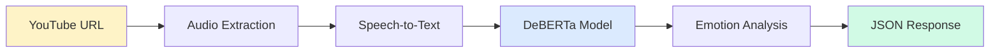

<div align="center">

<h1 style="color: #2563eb; margin-bottom: 10px;">Emotion Classification Pipeline</h1>

<p style="font-size: 18px; color: #64748b; margin-bottom: 20px;">
  <strong>Advanced NLP tool for extracting emotional insights from video and audio content</strong>
</p>

<div style="margin: 20px 0;">
  
  
  
  <br>
  
  
  
</div>

<div style="background: linear-gradient(135deg, #667eea 0%, #764ba2 100%); padding: 2px; border-radius: 15px; margin: 30px auto; max-width: 800px;">
  
</div>

<div style="margin: 30px 0;">
  <a href="https://bredauniversityadsai.github.io/2024-25d-fai2-adsai-group-nlp6/" style="background: #8b5cf6; color: white; padding: 12px 24px; border-radius: 8px; text-decoration: none; margin: 0 10px; font-weight: 600;">Documentation Webpage</a>
</div>

</div>

 

## Overview

Transform unstructured video and audio content into meaningful emotional analytics using our state-of-the-art NLP pipeline. Built with DeBERTa models and deployed on Azure ML, this system provides real-time emotion classification for content analysis, customer sentiment tracking, and research applications.


## Quick Start

### Prerequisites
- **Python 3.11+**
- **Docker** (recommended)
- **Poetry** for dependency management

### 1. Clone & Setup

```bash
git clone https://github.com/BredaUniversityADSAI/2024-25d-fai2-adsai-group-nlp6.git
cd 2024-25d-fai2-adsai-group-nlp6
```

### 2. Environment Configuration

Create `.env` file in the project root:

```bash
# Required API Keys
ASSEMBLYAI_API_KEY="your_assemblyai_key"
GEMINI_API_KEY="your_gemini_key"

# Azure ML Configuration (Optional)
AZURE_SUBSCRIPTION_ID="your_subscription_id"
AZURE_RESOURCE_GROUP="buas-y2"
AZURE_WORKSPACE_NAME="NLP6-2025"
AZURE_LOCATION="westeurope"
AZURE_TENANT_ID="your_tenant_id"
AZURE_CLIENT_ID="your_client_id"
AZURE_CLIENT_SECRET="your_client_secret"
```

### 3. Launch Application

<div style="display: grid; grid-template-columns: 1fr 1fr; gap: 20px; margin: 20px 0;">

<div style="border: 2px solid #3b82f6; border-radius: 12px; padding: 20px; background: #eff6ff;">
  <h4 style="color: #1d4ed8; margin-top: 0;">🐳 Docker (Recommended)</h4>
  <p>Complete full-stack deployment:</p>
  <pre style="background: #1e293b; color: #e2e8f0; padding: 10px; border-radius: 6px; margin: 10px 0;"><code>docker-compose up --build</code></pre>
  <p><strong>Access:</strong><br>
  • Frontend: <code>http://localhost:3121</code><br>
  • API: <code>http://localhost:3120</code></p>
</div>

<div style="border: 2px solid #10b981; border-radius: 12px; padding: 20px; background: #ecfdf5;">
  <h4 style="color: #047857; margin-top: 0;">💻 Development Mode</h4>
  <p>For development and debugging:</p>
  <pre style="background: #1e293b; color: #e2e8f0; padding: 10px; border-radius: 6px; margin: 10px 0;"><code>poetry install && poetry shell
uvicorn src.emotion_clf_pipeline.api:app --reload</code></pre>
  <p><strong>CLI Usage:</strong></p>
  <pre style="background: #1e293b; color: #e2e8f0; padding: 10px; border-radius: 6px; margin: 10px 0;"><code>python -m emotion_clf_pipeline.cli predict "YOUTUBE_URL"</code></pre>
</div>

</div>

### 4. API Usage Examples

<details>
<summary><strong>REST API</strong></summary>

```bash
# cURL example
curl -X POST "http://localhost:3120/predict" \
  -H "Content-Type: application/json" \
  -d '{"url": "https://www.youtube.com/watch?v=dQw4w9WgXcQ"}'

# PowerShell example
Invoke-RestMethod -Uri "http://localhost:3120/predict" -Method Post \
  -ContentType "application/json" \
  -Body '{"url": "https://www.youtube.com/watch?v=dQw4w9WgXcQ"}'
```

</details>

<details>
<summary><strong>Python SDK</strong></summary>

```python
import requests

response = requests.post(
    "http://localhost:3120/predict",
    json={"url": "https://www.youtube.com/watch?v=dQw4w9WgXcQ"}
)
emotions = response.json()
```

</details>

 

## Architecture

<div align="center">



</div>

### System Components

<table style="width: 100%; border-collapse: collapse;">
  <tr>
    <th style="background: #f8fafc; padding: 15px; border: 1px solid #e2e8f0; text-align: left;">Component</th>
    <th style="background: #f8fafc; padding: 15px; border: 1px solid #e2e8f0; text-align: left;">Technology</th>
    <th style="background: #f8fafc; padding: 15px; border: 1px solid #e2e8f0; text-align: left;">Purpose</th>
  </tr>
  <tr>
    <td style="padding: 15px; border: 1px solid #e2e8f0;"><strong>Frontend</strong></td>
    <td style="padding: 15px; border: 1px solid #e2e8f0;">React.js</td>
    <td style="padding: 15px; border: 1px solid #e2e8f0;">Interactive web interface</td>
  </tr>
  <tr>
    <td style="padding: 15px; border: 1px solid #e2e8f0;"><strong>API</strong></td>
    <td style="padding: 15px; border: 1px solid #e2e8f0;">FastAPI</td>
    <td style="padding: 15px; border: 1px solid #e2e8f0;">REST endpoints and validation</td>
  </tr>
  <tr>
    <td style="padding: 15px; border: 1px solid #e2e8f0;"><strong>ML Pipeline</strong></td>
    <td style="padding: 15px; border: 1px solid #e2e8f0;">DeBERTa + PyTorch</td>
    <td style="padding: 15px; border: 1px solid #e2e8f0;">Emotion classification</td>
  </tr>
  <tr>
    <td style="padding: 15px; border: 1px solid #e2e8f0;"><strong>Speech Processing</strong></td>
    <td style="padding: 15px; border: 1px solid #e2e8f0;">AssemblyAI / Whisper</td>
    <td style="padding: 15px; border: 1px solid #e2e8f0;">Audio transcription</td>
  </tr>
  <tr>
    <td style="padding: 15px; border: 1px solid #e2e8f0;"><strong>Cloud Platform</strong></td>
    <td style="padding: 15px; border: 1px solid #e2e8f0;">Azure ML</td>
    <td style="padding: 15px; border: 1px solid #e2e8f0;">Training & deployment</td>
  </tr>
</table>


 ## Common Commands

 There are two ways to interact with the code. To either process them on premise or on cloud. Below you can see a comprehensive guideline on how to use various commands on both option.

### Option 1 - On Premise 

`Data preprocessing`: Preprocess the data and save them in the specified location.
```bash
python -m emotion_clf_pipeline.cli preprocess --verbose --raw-train-path "data/raw/train" --raw-test-path "data/raw/test/test_data-0001.csv"
```

`Train and evaluate`: Train the model and evaluate it on various data splits, which includes model syncing with Azure model (i.e., first downloading the best model from azure, and finally registering the weight to Azure model):
```bash
python -m emotion_clf_pipeline.cli train --epochs 15 --learning-rate 1e-5 --batch-size 16
```

`Prediction`: There are various methods when it comes to get the prediction:
```bash
# Option 1 - API
uvicorn src.emotion_clf_pipeline.api:app --host 0.0.0.0 --port 3120 --reload    # Start backend api
# Make an API call: Invoke-RestMethod -Uri "http://127.0.0.1:3120/predict" -Method Post -ContentType "application/json" -Body '{"url": "YOUTUBE-LINK"}'

# Option 2 - CLI
python -m emotion_clf_pipeline.cli predict "YOUTUBE-LINK"

# Option 3 - Docker container (backend only)
docker build -t emotion-clf-api .
docker run -p 3120:80 emotion-clf-api

# Option 4 - Docker compose (both frontend and backend)
docker-compose up --build
```

### Option 2 - On Cloud (Azure)

`Data preprocessing job`: It takes the data from 'emotion-raw-train' and 'emotion-raw-test' and then registered the final preprocessed data into 'emotion-processed-train' and 'emotion-processed-test'
```bash
poetry run python -m emotion_clf_pipeline.cli preprocess --azure --register-data-assets --verbose
```

`Training job`: It takes the preprocessed data and train the model using them, evaluate them, and finally register the weights.
```bash
poetry run python -m emotion_clf_pipeline.cli train --azure --verbose
```

`Full pipeline`: This is the combination of data and train pipeline from above.
```bash
poetry run python -m emotion_clf_pipeline.cli train-pipeline --azure --verbose
```

`Scheduled pipeline`: This command create a schedule for the full pipeline on the specified time schedule.
```bash
python -m src.emotion_clf_pipeline.cli schedule create --schedule-name 'scheduled-deberta-full-pipeline' --daily --hour 0 --minute 0 --enabled --mode azure
```

`Hyperparameter tunning sweep`: This create multiple sweeps for doing hyperparameter tunning.
```bash
poetry run python -m emotion_clf_pipeline.hyperparameter_tuning
```

`Prediction`: We can make a prediction on Azure ML Endpoint using this command.
```bash
python -m emotion_clf_pipeline.cli predict "YOUTUBE-LINK" --use-azure
python -m emotion_clf_pipeline.cli predict "https://youtube.com/watch?v=VIDEO_ID" --use-azure --use-ngrok
```
 

## Contributing

### Development Workflow

```bash
# Set up development environment
poetry install
poetry run pre-commit install

# Run quality checks
poetry run pre-commit run --all-files
poetry run pytest -v
```

### Branch Naming Convention

```
<type>/<sprint>-<scope>-<action>
```

**Examples:** `feature/s2-data-add-youtube-transcript`, `fix/s3-api-error-handling`

**Types:** `feature`, `fix`, `test`, `docs`, `config`, `chore`, `refactor`

### Pull Request Process

1. Create feature branch from `main`
2. Implement changes with tests
3. Ensure all checks pass
4. Submit PR with clear description
5. Address review feedback
6. Merge after approval

 

## Testing

### Running Tests

```bash
# All tests
poetry run pytest -v

# Specific test types
poetry run pytest tests/unit -v
poetry run pytest tests/integration -v

# With coverage
poetry run coverage run -m pytest
poetry run coverage report
poetry run coverage html
```

### Test Structure

- **Unit Tests**: Test individual components in isolation
- **Integration Tests**: Test component interactions
- **API Tests**: Test REST endpoint functionality

 

## Advanced Features

### Git LFS for Large Files

For managing large model files, configure Git LFS:

```bash
# Install and initialize Git LFS
git lfs install

# Track model files
git lfs track "models/*"

# Commit LFS configuration
git add .gitattributes && git commit -m "Configure Git LFS"
```

### Development Tools

<div style="display: grid; grid-template-columns: 1fr 1fr; gap: 20px;">

<div>
<h4>Code Quality</h4>

```bash
# Pre-commit hooks
poetry run pre-commit install
poetry run pre-commit run --all-files

# Linting
poetry run flake8 src/
poetry run black src/
```
</div>

<div>
<h4>Documentation</h4>

```bash
# Generate API docs
cd docs && make html

# Serve documentation
python -m http.server 8000 -d docs/_build/html
```
</div>

</div>

 

## License

This project is licensed under the **MIT License**.
