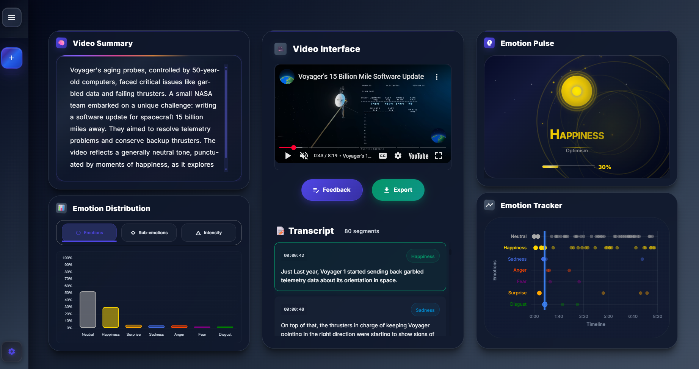

# Emotion Classification Pipeline

<div align="center">

**Advanced NLP tool for extracting emotional insights from video and audio content**

[](https://www.python.org/downloads/)
[](LICENSE)
[](https://python-poetry.org/)
[](https://github.com/BredaUniversityADSAI/2024-25d-fai2-adsai-group-nlp6/actions)
[](https://github.com/BredaUniversityADSAI/2024-25d-fai2-adsai-group-nlp6/actions)
[](https://github.com/BredaUniversityADSAI/2024-25d-fai2-adsai-group-nlp6/actions)



[📖 **Documentation**](https://bredauniversityadsai.github.io/2024-25d-fai2-adsai-group-nlp6/) | [🚀 **Quick Start**](#quick-start) | [🔧 **API Docs**](#api-reference)

</div>

---

## Overview

Transform unstructured video and audio content into meaningful emotional analytics using state-of-the-art NLP techniques. Built with DeBERTa models and deployed on Azure ML, this system provides real-time emotion classification for:

- **Content Analysis**: Understand emotional tone in videos and podcasts
- **Customer Sentiment**: Track emotional responses in customer interactions
- **Research Applications**: Analyze emotional patterns in media content
- **Educational Tools**: Study emotional expression in educational content

### Key Features

🎯 **Multi-Modal Processing**: Video and audio content analysis  
🧠 **Advanced NLP**: DeBERTa-based emotion classification  
☁️ **Cloud-Ready**: Azure ML integration with automated pipelines  
🔄 **Real-Time**: Fast API responses with efficient processing  
🌐 **Multi-Language**: Support for various languages via translation  
📊 **Comprehensive Analytics**: Detailed emotion breakdowns and confidence scores

---

## Quick Start

### Prerequisites

- **Python 3.11+**
- **Docker** (recommended for full-stack deployment)
- **Poetry** for dependency management

### Installation & Setup

**1. Clone Repository**
```bash
git clone https://github.com/BredaUniversityADSAI/2024-25d-fai2-adsai-group-nlp6.git
cd 2024-25d-fai2-adsai-group-nlp6
```

**2. Environment Configuration**

Create `.env` file with your API keys:
```env
# Required
ASSEMBLYAI_API_KEY="your_assemblyai_key"
GEMINI_API_KEY="your_gemini_key"

# Optional (for Azure ML features)
AZURE_SUBSCRIPTION_ID="your_subscription_id"
AZURE_RESOURCE_GROUP="buas-y2"
AZURE_WORKSPACE_NAME="NLP6-2025"
```

**3. Choose Deployment Method**

#### Option A: Docker (Recommended)
```bash
# Full-stack deployment (Frontend + Backend)
docker-compose up --build

# Access at:
# Frontend: http://localhost:3121
# API: http://localhost:3120
```

#### Option B: Development Mode
```bash
# Install dependencies
poetry install && poetry shell

# Start backend API
uvicorn src.emotion_clf_pipeline.api:app --reload --port 3120

# In another terminal, start frontend
cd frontend && npm start
```

#### Option C: CLI Only
```bash
poetry install && poetry shell
python -m emotion_clf_pipeline.cli predict "https://www.youtube.com/watch?v=dQw4w9WgXcQ"
```

### Quick Test

```bash
# Test API endpoint
curl -X POST "http://localhost:3120/predict" \
  -H "Content-Type: application/json" \
  -d '{"url": "https://www.youtube.com/watch?v=dQw4w9WgXcQ"}'
```

---

## System Architecture


### Core Components

| Component | Technology | Purpose |
|-----------|------------|---------|
| **Frontend** | React.js | Interactive web interface |
| **API Server** | FastAPI | REST endpoints and validation |
| **ML Pipeline** | DeBERTa + PyTorch | Emotion classification engine |
| **Speech Processing** | AssemblyAI/Whisper | Audio transcription |
| **Cloud Platform** | Azure ML | Training and deployment |
| **CLI Tool** | Python | Command-line interface |

---

## API Reference

### Endpoints

#### `POST /predict`
Analyze emotions in YouTube video content.

**Request:**
```json
{
  "url": "https://www.youtube.com/watch?v=VIDEO_ID"
}
```

**Response:**
```json
{
  "videoId": "VIDEO_ID",
  "title": "Video Title",
  "duration": 180,
  "transcript": [
    {
      "sentence": "This is a sample sentence.",
      "emotion": "joy",
      "confidence": 0.95,
      "timestamp": "00:01:30"
    }
  ],
  "summary": {
    "dominant_emotion": "joy",
    "emotion_distribution": {
      "joy": 0.45,
      "neutral": 0.30,
      "sadness": 0.25
    }
  }
}
```

#### `GET /health`
Health check endpoint.

**Response:**
```json
{
  "status": "healthy",
  "timestamp": "2025-06-25T10:30:00Z"
}
```

### Error Codes

| Code | Description | Resolution |
|------|-------------|------------|
| 400 | Bad Request | Invalid URL format or missing parameters |
| 422 | Validation Error | Request body doesn't match expected schema |
| 500 | Internal Server Error | Check server logs; verify API keys |

### Usage Examples

**Python:**
```python
import requests

response = requests.post(
    "http://localhost:3120/predict",
    json={"url": "https://www.youtube.com/watch?v=dQw4w9WgXcQ"}
)
result = response.json()
```

**JavaScript:**
```javascript
const response = await fetch('http://localhost:3120/predict', {
  method: 'POST',
  headers: { 'Content-Type': 'application/json' },
  body: JSON.stringify({ url: 'https://www.youtube.com/watch?v=dQw4w9WgXcQ' })
});
const result = await response.json();
```

---

## Development Guide

### Project Structure

```
src/emotion_clf_pipeline/
├── api.py                   # FastAPI server
├── predict.py               # Main prediction pipeline
├── model.py                 # DeBERTa model implementation
├── data.py                  # Data processing utilities
├── stt.py                   # Speech-to-text processing
├── cli.py                   # Command-line interface
├── azure_*.py               # Azure ML integration
└── monitoring.py            # System monitoring
```

### Local Development Commands

**Data Processing:**
```bash
# Preprocess training data
python -m emotion_clf_pipeline.cli preprocess --verbose

# Train model locally
python -m emotion_clf_pipeline.cli train --epochs 10 --batch-size 16
```

**Testing:**
```bash
# Run all tests
poetry run pytest -v

# Run with coverage
poetry run coverage run -m pytest
poetry run coverage report

# Run specific test categories
poetry run pytest tests/test_api.py -v
```

**Code Quality:**
```bash
# Install pre-commit hooks
poetry run pre-commit install

# Run quality checks
poetry run pre-commit run --all-files
poetry run flake8 src/
poetry run black src/
```

### Azure ML Integration

**Cloud Training:**
```bash
# Train on Azure ML
poetry run python -m emotion_clf_pipeline.cli train --azure --verbose

# Register datasets
poetry run python -m emotion_clf_pipeline.cli preprocess --azure --register-data-assets
```

**Hyperparameter Tuning:**
```bash
# Launch hyperparameter sweep
poetry run python -m emotion_clf_pipeline.azure_hyperparameter_sweep
```

**Scheduling:**
```bash
# Create daily retraining schedule
python -m emotion_clf_pipeline.cli schedule create \
  --schedule-name 'daily-retraining' \
  --daily --hour 0 --minute 0 \
  --enabled --mode azure
```

---

## Contributing

### Development Workflow

1. **Setup Environment**
   ```bash
   poetry install
   poetry run pre-commit install
   ```

2. **Create Feature Branch**
   ```bash
   git checkout -b feature/your-feature-name
   ```

3. **Development Standards**
   - Follow PEP 8 with Black formatting
   - Include docstrings for public functions
   - Maintain >80% test coverage
   - Use type annotations

4. **Quality Checks**
   ```bash
   poetry run pytest -v
   poetry run pre-commit run --all-files
   poetry run coverage run -m pytest && poetry run coverage report
   ```

5. **Submit Pull Request**
   - Clear description of changes
   - Link to related issues
   - Ensure all CI checks pass

### Branch Naming Convention

Use the format: `<type>/<sprint>-<scope>-<action>`

**Examples:**
- `feature/s2-data-add-youtube-transcript`
- `fix/s3-api-error-handling`
- `docs/s4-update-readme-structure`

**Types:** `feature`, `fix`, `test`, `docs`, `config`, `chore`, `refactor`

---

## Advanced Features

### Git LFS for Large Files

For model files and large assets:

```bash
# Install and setup Git LFS
git lfs install
git lfs track "models/*" "*.pkl" "*.pth" "*.bin"
git add .gitattributes
git commit -m "Add Git LFS tracking"
```

### Monitoring and Observability

The system includes comprehensive monitoring:

- **Health Checks**: Endpoint monitoring
- **Performance Metrics**: Response times and throughput
- **Error Tracking**: Detailed error logging
- **Resource Usage**: Memory and CPU monitoring

### Multi-Language Support

Support for non-English content through:
- Automatic language detection
- Translation to English for processing
- Preserved original language context

---

## Testing

### Test Categories

- **Unit Tests**: Individual component testing
- **Integration Tests**: Component interaction testing
- **API Tests**: Endpoint functionality testing
- **CLI Tests**: Command-line interface testing

### Running Tests

```bash
# All tests
poetry run pytest -v

# Specific categories
poetry run pytest tests/test_api.py -v
poetry run pytest tests/test_model*.py -v

# With coverage
poetry run coverage run -m pytest
poetry run coverage html  # Generate HTML report
```

### Continuous Integration

Automated testing through GitHub Actions:
- **Lint Checks**: Code quality validation
- **Test Suite**: Comprehensive test execution
- **Docker Build**: Container validation
- **Documentation**: Sphinx documentation build

---

## Deployment

### Production Deployment

**Docker Compose (Recommended):**
```bash
# Production deployment
docker-compose -f docker-compose.yml up -d

# Build from source
docker-compose -f docker-compose.build.yml up --build
```

**Manual Deployment:**
```bash
# Build container
docker build -t emotion-clf-api .

# Run with environment variables
docker run -p 3120:80 --env-file .env emotion-clf-api
```

### Environment Variables

Required for production:
```env
ASSEMBLYAI_API_KEY=your_key
GEMINI_API_KEY=your_key
ENVIRONMENT=production
LOG_LEVEL=INFO
```

---

## Troubleshooting

### Common Issues

**1. API Key Errors**
- Verify API keys in `.env` file
- Check key validity and permissions

**2. Docker Build Issues**
- Ensure Docker is running
- Check available disk space
- Clear Docker cache: `docker system prune`

**3. Model Loading Errors**
- Verify model files exist in `models/` directory
- Check file permissions
- Ensure adequate memory

**4. YouTube Access Issues**
- Check video accessibility
- Verify network connectivity
- Ensure video has audio content

### Getting Help

- **Documentation**: [Full Documentation](https://bredauniversityadsai.github.io/2024-25d-fai2-adsai-group-nlp6/)
- **Issues**: [GitHub Issues](https://github.com/BredaUniversityADSAI/2024-25d-fai2-adsai-group-nlp6/issues)
- **Discussions**: [GitHub Discussions](https://github.com/BredaUniversityADSAI/2024-25d-fai2-adsai-group-nlp6/discussions)

---

## License

This project is licensed under the [MIT License](LICENSE).

---

## Acknowledgments

- **Breda University of Applied Sciences** - Project sponsorship
- **DeBERTa Team** - Model architecture
- **AssemblyAI** - Speech-to-text services
- **Azure ML** - Cloud infrastructure
- **Contributors** - Open-source community support
