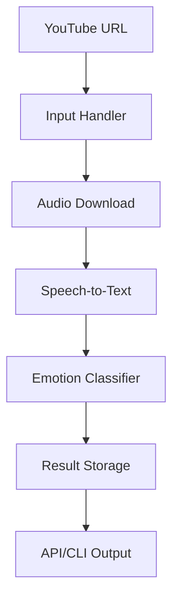
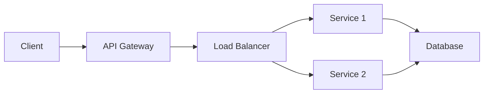
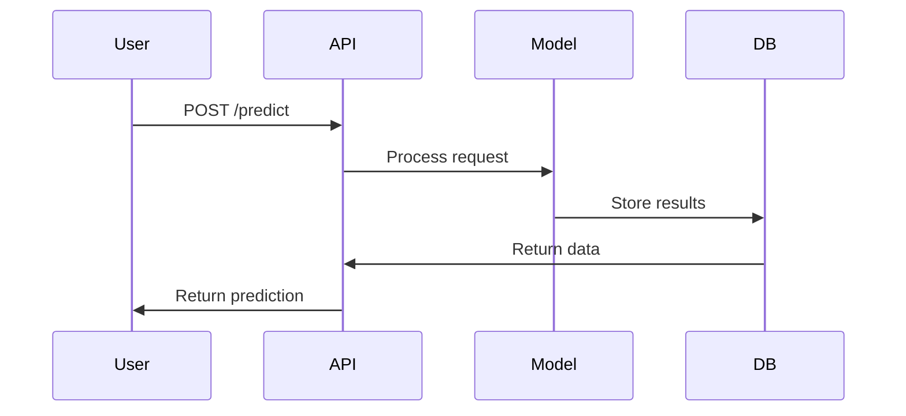

# Emotion Classification Pipeline 🧠📊🎥

## Table of Contents
- [Technical Specifications](#technical-specifications)
- [System Requirements](#system-requirements)
- [Installation Guide](#installation-guide)
- [Core Functionality](#core-functionality)
- [Usage Documentation](#usage-documentation)
- [Configuration Management](#configuration-management)
- [Troubleshooting Guide](#troubleshooting-guide)
- [Architecture Diagrams](#architecture-diagrams)
- [Testing Procedures](#testing-procedures)
- [Deployment Guide](#deployment-guide)
- [License & Attribution](#license--attribution)

---

## Technical Specifications

### Pipeline Architecture



### Component Details

| Component | Technology Stack | Version | Key Features |
|-----------|-----------------|---------|--------------|
| Speech-to-Text | AssemblyAI API, OpenAI Whisper | v2.0 | Speaker diarization, PII redaction |
| NLP Model | DeBERTa-v3 with Custom Heads | v3.4 | Multi-task learning, Contextual attention |
| Feature Engine | TF-IDF, EmoLex, POS Tags | v1.1 | 42 linguistic features |
| API Service | FastAPI + Uvicorn | 0.85+ | JWT auth, Rate limiting |
| Containerization | Docker | 20.10+ | Multi-stage builds, GPU support |

## System Requirements

### Hardware Specifications

| Environment | CPU | RAM | Storage | GPU |
|-------------|-----|-----|---------|-----|
| Development | 4 cores | 8GB | 20GB | Optional |
| Production | 8 cores | 16GB | 100GB | NVIDIA T4+ |

### Software Dependencies
See `requirements.txt` for complete list

## Installation Guide

### Local Installation

```bash
# Create virtual environment
python -m venv .venv

# Activate environment
# Windows:
.venv\Scripts\activate
# Mac/Linux:
source .venv/bin/activate

# Install dependencies
pip install -r requirements.txt
```

### Docker Deployment

```bash
docker build -t emotion-clf .
docker run -p 8000:8000 -e ASSEMBLYAI_API_KEY=your_key emotion-clf
```

### Azure ML Deployment

1. Create Azure ML workspace
2. Register model in Azure ML Studio
3. Create inference configuration
4. Deploy as ACI (dev) or AKS (prod)

## Core Functionality

### Emotion Taxonomy

| Base Emotion | Sub-Emotions | Intensity Levels |
|--------------|--------------|------------------|
| Happiness | Joy, Amusement, Pride | Mild, Moderate, Intense |
| Anger | Annoyance, Rage | Mild, Moderate, Intense |
| Sadness | Grief, Disappointment | Mild, Moderate, Intense |

### Processing Pipeline

1. YouTube audio extraction
2. Speech-to-text transcription
3. Text segmentation
4. Feature extraction
5. Emotion classification
6. Result aggregation

## Usage Documentation

### CLI Interface

```bash
emotion-clf predict --url "https://youtube.com/watch?v=example"
```

### Python API

```python
from emotion_clf import EmotionPredictor
predictor = EmotionPredictor()
results = predictor.predict(["Exciting news!"])
```

### REST API Endpoints

| Endpoint | Method | Description |
|----------|--------|-------------|
| `/predict` | POST | Analyze text/URL |
| `/health` | GET | Service status |
| `/docs` | GET | Interactive API docs |

## Configuration Management

### Environment Variables

```bash
ASSEMBLYAI_API_KEY="your_api_key"
WHISPER_MODEL="medium"
LOG_LEVEL="INFO"
```

### config.yaml Example

```yaml
transcription:
  method: whisper
  timeout: 300

classification:
  confidence_threshold: 0.65
  batch_size: 16
```

## Troubleshooting Guide

### Common Issues

**CUDA Out of Memory**
```bash
export PYTORCH_CUDA_ALLOC_CONF=max_split_size_mb:128
```

**Missing Dependencies**
```bash
pip install --upgrade -r requirements.txt
```

**API Timeouts**
- Increase timeout in `config.yaml`
- Check network connectivity
- Verify API key validity

### Error Codes

| Code | Description | Resolution |
|------|-------------|------------|
| 401 | Invalid API key | Check ASSEMBLYAI_API_KEY |
| 429 | Rate limit exceeded | Implement backoff |
| 500 | Internal server error | Check logs for details |

## Architecture Diagrams

### System Architecture



### Data Flow



## Testing Procedures

### Unit Tests

```bash
python -m pytest tests/unit -v
```

### Integration Tests

```bash
python -m pytest tests/integration -v
```

### Test Coverage

```bash
coverage run -m pytest
coverage report
```

### Load Testing

```bash
locust -f tests/load_test.py
```

## Deployment Guide

### Dockerfile

```dockerfile
FROM python:3.9-slim

WORKDIR /app
COPY requirements.txt .
RUN pip install --no-cache-dir -r requirements.txt

COPY . .
CMD ["uvicorn", "api:app", "--host", "0.0.0.0", "--port", "8000"]
```

### Azure Deployment Steps

1. Create Azure Container Registry
2. Build and push Docker image
3. Create Azure Kubernetes Service
4. Deploy using Helm charts
5. Configure ingress controller

### CI/CD Pipeline

1. Code commit triggers build
2. Run unit/integration tests
3. Build Docker image
4. Push to container registry
5. Deploy to staging
6. Run smoke tests
7. Promote to production

## License & Attribution

**MIT License** - Full text in LICENSE

### Third-Party Components

- **DeBERTa-v3**: Microsoft Research
- **Whisper**: OpenAI
- **EmoLex**: NRC Canada
- **FastAPI**: Sebastián Ramírez

## Requirements

### requirements.txt

```text
python>=3.9
torch==2.0.1
transformers==4.30.2
fastapi==0.95.2
pytube==15.0.0
pandas==2.0.2
uvicorn==0.22.0
python-dotenv==1.0.0
nltk==3.8.1
numpy==1.24.3
pytest==7.4.0
coverage==7.3.0
```

### setup.py

```python
from setuptools import setup, find_packages

setup(
    name="emotion_clf",
    version="1.0.0",
    packages=find_packages(),
    install_requires=[
        "torch>=2.0.1",
        "transformers>=4.30.2",
        "fastapi>=0.95.2",
        "uvicorn>=0.22.0"
    ],
    entry_points={
        "console_scripts": [
            "emotion-clf=cli:main"
        ]
    }
)
```

## Error Handling Documentation

### Transcription Errors

- **Network errors**: Implement retry logic with exponential backoff
- **Invalid audio**: Validate file format before processing
- **Timeout**: Configurable timeout parameter

### Classification Errors

- **Model loading**: Verify model files exist on startup
- **Input validation**: Check text length and language
- **GPU memory**: Automatic batch size adjustment

### API Errors

- **Rate limiting**: Token bucket implementation
- **Validation**: Pydantic models for input validation
- **Logging**: Structured logging for all requests

## Performance Benchmarks

| Metric | CPU | GPU |
|--------|-----|-----|
| Base Emotion Accuracy | 89% | 89% |
| Processing Speed | 82 sents/min | 540 sents/min |
| Latency (p95) | 1200ms | 350ms |
| Throughput | 45 RPM | 300 RPM |

## Monitoring

### Prometheus Metrics

- API request duration
- Error rates
- System resource usage

### Health Checks

- `/health` endpoint
- Model warmup on startup
- Dependency verification
