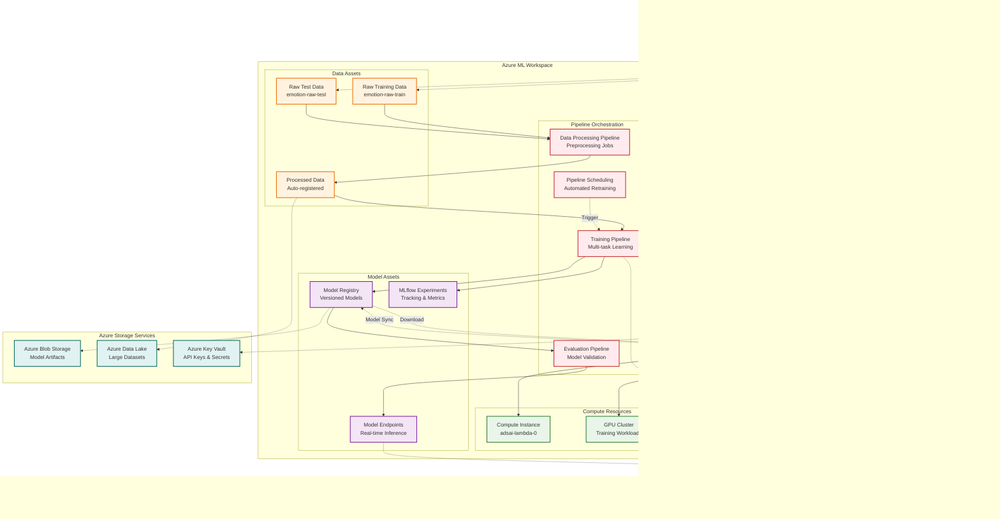

# System Architecture - Emotion Classification Pipeline

## 🏗️ Overview

The Emotion Classification Pipeline is a sophisticated, cloud-native system that analyzes emotional content from YouTube videos through advanced natural language processing. The system follows a microservices architecture with AI/ML capabilities, real-time processing, and comprehensive visualization features.

---

## 🏛️ High-Level System Architecture

### System Components Overview


---

## 📊 Data Flow Architecture

### End-to-End Processing Pipeline

```mermaid
sequenceDiagram
    participant User as 👤 User
    participant Frontend as 🌐 React Frontend
    participant API as 🚀 FastAPI Backend
    participant Orchestrator as 🎭 Prediction Service
    participant Downloader as 📥 Video Downloader
    participant STT as 🎤 Speech-to-Text
    participant AI as 🧠 Emotion Classifier
    participant Storage as 💾 File System
    
    User->>Frontend: Input YouTube URL
    Frontend->>API: POST /predict {url}
    
    activate API
    API->>Orchestrator: process_youtube_url_and_predict()
    
    activate Orchestrator
    Orchestrator->>Downloader: download_audio(youtube_url)
    
    activate Downloader
    Downloader->>Storage: Save audio.mp3
    Downloader-->>Orchestrator: audio_file_path
    deactivate Downloader
    
    Orchestrator->>STT: transcribe_audio(audio_path)
    
    activate STT
    STT->>Storage: Save transcript.json
    STT-->>Orchestrator: transcript_segments[]
    deactivate STT
    
    loop For each transcript segment
        Orchestrator->>AI: predict_emotion(text_segment)
        
        activate AI
        AI->>AI: Feature extraction
        AI->>AI: DeBERTa inference
        AI->>AI: Multi-task prediction
        AI-->>Orchestrator: {emotion, sub_emotion, intensity}
        deactivate AI
    end
    
    Orchestrator->>Storage: Save results.json
    Orchestrator-->>API: Structured predictions
    deactivate Orchestrator
    
    API-->>Frontend: JSON response with timeline
    deactivate API
    
    Frontend->>Frontend: Render visualizations
    Frontend->>User: Display emotion analysis
```



---

## 🧩 Microservices Architecture

### Service Decomposition


---

## 🛠️ Component Architecture

### Backend Module Structure

```mermaid
graph LR
    subgraph "src/emotion_clf_pipeline"
        API[api.py<br/>🚀 FastAPI Endpoints]
        CLI[cli.py<br/>💻 Command Interface]
        PREDICT[predict.py<br/>🎭 Main Orchestrator]
        MODEL[model.py<br/>🧠 AI/ML Models]
        DATA[data.py<br/>📊 Data Processing]
        TRAIN[train.py<br/>🏋️ Model Training]
        STT[stt.py<br/>🎤 Speech-to-Text]
        FEATURES[features.py<br/>🔤 Feature Engineering]
        AZURE[azure_pipeline.py<br/>☁️ Cloud Integration]
        TRANSCRIPT[transcript.py<br/>📝 Text Processing]
    end
    
    %% Main Entry Points
    API --> PREDICT
    CLI --> PREDICT
    CLI --> TRAIN
    CLI --> DATA
    
    %% Core Processing Flow
    PREDICT --> MODEL
    PREDICT --> STT
    PREDICT --> DATA
    
    %% Training Pipeline
    TRAIN --> MODEL
    TRAIN --> DATA
    TRAIN --> FEATURES
    
    %% Model Dependencies
    MODEL --> FEATURES
    MODEL --> DATA
    
    %% Azure Integration
    TRAIN --> AZURE
    DATA --> AZURE
    
    %% Speech Processing
    STT --> TRANSCRIPT
    
    %% Styling
    classDef entryPoint fill:#E1F5FE,stroke:#0277BD,stroke-width:3px
    classDef coreLogic fill:#E8F5E8,stroke:#2E7D32,stroke-width:2px
    classDef mlComponent fill:#FFF3E0,stroke:#F57C00,stroke-width:2px
    classDef dataComponent fill:#FFEBEE,stroke:#C62828,stroke-width:2px
    classDef cloudComponent fill:#F3E5F5,stroke:#7B1FA2,stroke-width:2px
    
    class API,CLI entryPoint
    class PREDICT,STT coreLogic
    class MODEL,TRAIN,FEATURES mlComponent
    class DATA,TRANSCRIPT dataComponent
    class AZURE cloudComponent
```



### Frontend Component Hierarchy

```mermaid
graph TD
    subgraph "React Application Structure"
        APP[App.js<br/>🎯 Main Application]
        CONTEXT[VideoContext.js<br/>🔄 State Management]
        
        subgraph "Core Components"
            URLGPT[UrlInput.js<br/>📝 URL Input]
            PLAYER[VideoPlayer.js<br/>📺 Video Playback]
            TRANSCRIPT[Transcript.js<br/>📜 Text Display]
            HISTORY[VideoHistory.js<br/>📋 Analysis History]
        end
        
        subgraph "Visualization Components"
            EMO_CUR[EmotionCurrent.js<br/>💫 Live Emotion Display]
            EMO_BAR[EmotionBarChart.js<br/>📊 Emotion Distribution]
            EMO_TIME[EmotionTimeline.js<br/>📈 Timeline Visualization]
            FEEDBACK[FeedbackModal.js<br/>💬 User Feedback]
        end
        
        subgraph "Utility Components"
            SEARCH[SearchBar.js<br/>🔍 Search Interface]
            MEMORY[VideoMemoryHeader.js<br/>🧠 Memory Header]
            EMPTY[EmptyState.js<br/>🌟 Empty State UI]
        end
        
        subgraph "Services & Utils"
            API_SVC[api.js<br/>🌐 API Communication]
            UTILS[utils.js<br/>🛠️ Utility Functions]
        end
    end
    
    %% Component Relationships
    APP --> CONTEXT
    APP --> URLGPT
    APP --> PLAYER
    APP --> TRANSCRIPT
    APP --> HISTORY
    APP --> EMO_CUR
    APP --> EMO_BAR
    APP --> EMO_TIME
    APP --> FEEDBACK
    
    CONTEXT --> API_SVC
    TRANSCRIPT --> SEARCH
    HISTORY --> MEMORY
    APP --> EMPTY
    
    EMO_CUR --> UTILS
    EMO_BAR --> UTILS
    EMO_TIME --> UTILS
    
    %% Styling
    classDef mainApp fill:#E1F5FE,stroke:#0277BD,stroke-width:3px
    classDef coreComp fill:#E8F5E8,stroke:#2E7D32,stroke-width:2px
    classDef vizComp fill:#FFF3E0,stroke:#F57C00,stroke-width:2px
    classDef utilComp fill:#F3E5F5,stroke:#7B1FA2,stroke-width:2px
    classDef service fill:#FFEBEE,stroke:#C62828,stroke-width:2px
    
    class APP,CONTEXT mainApp
    class URLGPT,PLAYER,TRANSCRIPT,HISTORY coreComp
    class EMO_CUR,EMO_BAR,EMO_TIME,FEEDBACK vizComp
    class SEARCH,MEMORY,EMPTY utilComp
    class API_SVC,UTILS service
```



---

## 🤖 AI/ML Architecture

### Machine Learning Pipeline


### Model Architecture Details

```mermaid
graph LR
    subgraph "Input Processing"
        TEXT[Text Input<br/>Sentence/Segment]
        TOKENS[DeBERTa Tokenizer<br/>Subword Tokenization]
    end
    
    subgraph "Feature Extraction Parallel Paths"
        subgraph "Transformer Path"
            DEBERTA[DeBERTa Model<br/>microsoft/deberta-v3-base]
            CLS_TOKEN[CLS Token<br/>Sentence Representation]
        end
        
        subgraph "Engineered Features Path"
            POS_FEAT[POS Features<br/>Part-of-Speech Tags]
            SENT_FEAT[Sentiment Features<br/>VADER + TextBlob]
            LEX_FEAT[Lexicon Features<br/>EmoLex Mappings]
        end
    end
    
    subgraph "Feature Fusion"
        PROJECTION[Projection Layer<br/>Linear + Dropout]
        CONCAT[Feature Concatenation<br/>Transformer + Engineered]
        HIDDEN[Hidden Layer<br/>ReLU Activation]
    end
    
    subgraph "Multi-task Output Heads"
        EMO_LINEAR[Emotion Head<br/>Linear(hidden_dim → 7)]
        SUB_LINEAR[Sub-emotion Head<br/>Linear(hidden_dim → 28)]
        INT_LINEAR[Intensity Head<br/>Linear(hidden_dim → 3)]
        
        EMO_SOFTMAX[Emotion Softmax<br/>7 Emotions]
        SUB_SOFTMAX[Sub-emotion Softmax<br/>28 Sub-emotions]
        INT_SOFTMAX[Intensity Softmax<br/>3 Levels]
    end
    
    subgraph "Loss Computation"
        EMO_LOSS[Emotion CE Loss<br/>CrossEntropyLoss]
        SUB_LOSS[Sub-emotion CE Loss<br/>CrossEntropyLoss]
        INT_LOSS[Intensity CE Loss<br/>CrossEntropyLoss]
        WEIGHTED_LOSS[Weighted Multi-task Loss<br/>α*L_emo + β*L_sub + γ*L_int]
    end
    
    %% Input Flow
    TEXT --> TOKENS
    
    %% Parallel Feature Extraction
    TOKENS --> DEBERTA
    TOKENS --> POS_FEAT
    TOKENS --> SENT_FEAT
    TOKENS --> LEX_FEAT
    
    %% Feature Processing
    DEBERTA --> CLS_TOKEN
    
    %% Feature Fusion
    CLS_TOKEN --> PROJECTION
    POS_FEAT --> CONCAT
    SENT_FEAT --> CONCAT
    LEX_FEAT --> CONCAT
    PROJECTION --> CONCAT
    CONCAT --> HIDDEN
    
    %% Multi-task Outputs
    HIDDEN --> EMO_LINEAR
    HIDDEN --> SUB_LINEAR
    HIDDEN --> INT_LINEAR
    
    EMO_LINEAR --> EMO_SOFTMAX
    SUB_LINEAR --> SUB_SOFTMAX
    INT_LINEAR --> INT_SOFTMAX
    
    %% Loss Calculation
    EMO_SOFTMAX --> EMO_LOSS
    SUB_SOFTMAX --> SUB_LOSS
    INT_SOFTMAX --> INT_LOSS
    
    EMO_LOSS --> WEIGHTED_LOSS
    SUB_LOSS --> WEIGHTED_LOSS
    INT_LOSS --> WEIGHTED_LOSS
    
    %% Styling
    classDef inputLayer fill:#E3F2FD,stroke:#1565C0,stroke-width:2px
    classDef transformerPath fill:#E8F5E8,stroke:#2E7D32,stroke-width:2px
    classDef featurePath fill:#FFF3E0,stroke:#EF6C00,stroke-width:2px
    classDef fusionLayer fill:#F3E5F5,stroke:#7B1FA2,stroke-width:2px
    classDef outputLayer fill:#FFEBEE,stroke:#C62828,stroke-width:2px
    classDef lossLayer fill:#E0F2F1,stroke:#00695C,stroke-width:2px
    
    class TEXT,TOKENS inputLayer
    class DEBERTA,CLS_TOKEN transformerPath
    class POS_FEAT,SENT_FEAT,LEX_FEAT featurePath
    class PROJECTION,CONCAT,HIDDEN fusionLayer
    class EMO_LINEAR,SUB_LINEAR,INT_LINEAR,EMO_SOFTMAX,SUB_SOFTMAX,INT_SOFTMAX outputLayer
    class EMO_LOSS,SUB_LOSS,INT_LOSS,WEIGHTED_LOSS lossLayer
```

---

## 🌐 Deployment Architecture

### Container Infrastructure


### Cloud Architecture (Azure ML Integration)



---

## 🔄 Real-time Processing Flow

### Live Emotion Analysis Pipeline


---

## 📱 User Interface Architecture

### Frontend Component Interaction Flow


---

## 🔒 Security & Authentication Architecture

### Security Implementation Layers


---

## 📊 Performance & Scalability Architecture

### Performance Optimization Strategy


---

## 🔄 DevOps & CI/CD Architecture

### Development Workflow & Automation


---

## 📋 Technology Stack Summary

### Complete Technology Matrix


---

## 🎯 Key Architectural Decisions

### Design Principles & Rationale

| **Decision** | **Rationale** | **Trade-offs** |
|--------------|---------------|----------------|
| **Microservices Architecture** | Separation of concerns, independent scaling, technology diversity | Increased complexity, network overhead |
| **FastAPI Backend** | High performance, automatic documentation, type safety | Learning curve, Python-specific |
| **React Frontend** | Component reusability, large ecosystem, real-time updates | Bundle size, client-side complexity |
| **DeBERTa Multi-task Model** | State-of-the-art NLP, efficient single model for multiple outputs | Large model size, inference latency |
| **Docker Containerization** | Environment consistency, easy deployment, isolation | Resource overhead, complexity |
| **Azure ML Integration** | Scalable training, managed infrastructure, MLOps features | Cloud vendor lock-in, cost considerations |
| **AssemblyAI + Whisper Fallback** | High accuracy transcription with local backup | API dependency, cost per request |
| **Real-time Visualization** | Better user experience, immediate feedback | Increased frontend complexity |

---

## 🚀 Future Architecture Enhancements

### Planned Improvements & Scalability


---

## 📖 Conclusion

The Emotion Classification Pipeline represents a comprehensive, production-ready system that combines cutting-edge AI/ML capabilities with modern software architecture principles. The system is designed for:

- **Scalability**: Microservices architecture with cloud-native deployment
- **Reliability**: Robust error handling, fallback mechanisms, and monitoring
- **Performance**: Optimized inference pipeline with caching and GPU acceleration
- **Maintainability**: Clean code structure, comprehensive testing, and automated CI/CD
- **Extensibility**: Modular design allowing for easy feature additions and model updates

The architecture successfully balances complexity with functionality, providing a solid foundation for emotional intelligence applications while maintaining the flexibility to evolve with changing requirements and technological advances.
